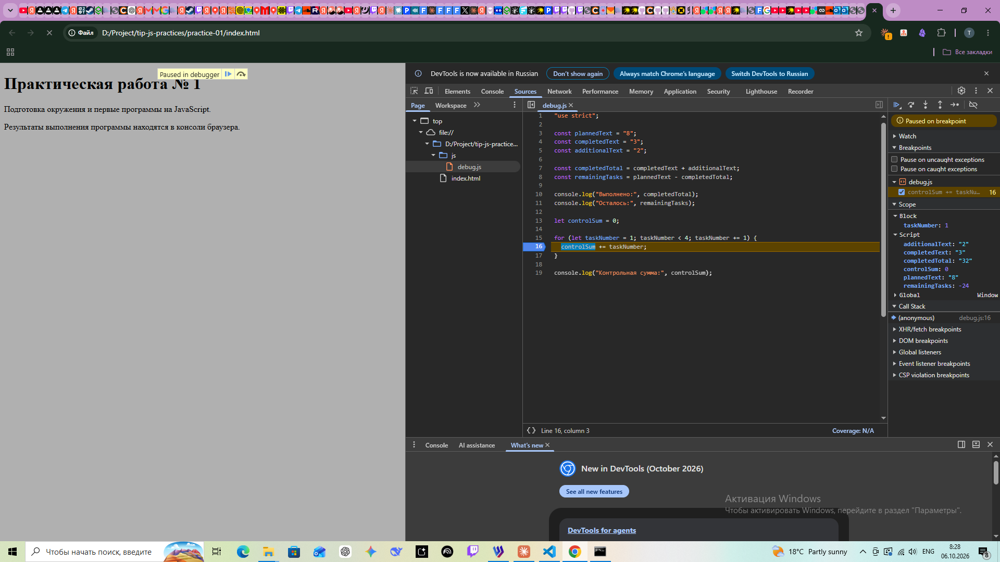

# Практическая работа № 1. Подготовка окружения и первые программы на JavaScript

## 1. Автор и вариант

- Имя: Тимофей
- Группа: ЭФБО-05-25
- Номер в журнале: 19
- Вариант: 3 (`variant = ((19 - 1) % 8) + 1 = 3`), данные: `totalTasks = 9`, `completedTasks = 9`, `dailyLimit = 3`

## 2. Окружение

| Инструмент | Версия |
| --- | --- |
| Операционная система | Windows 10, версия 10.0.19045.6456 |
| Node.js | v24.15.0 (ветка 24 LTS) |
| npm | 11.12.1 |
| Git | 2.54.0.windows.1 |
| Браузер | Google Chrome |

## 3. Запуск

Команды выполняются из корня репозитория (`tip-js-practices`):

```
node practice-01/js/hello.js
node practice-01/js/types.js
node practice-01/js/progress.js
node practice-01/js/plan.js
node practice-01/js/debug.js
```

Запуск в браузере: открыть `practice-01/index.html`, нажать F12, перейти на вкладку Console. Чтобы проверить другое задание, в `index.html` меняется путь в теге `script` (например, на `./js/types.js`), файл сохраняется, страница перезагружается. В каждый момент подключён только один файл.

## 4. Задание 1. Один файл — две среды выполнения

Файл `practice-01/js/hello.js` запускался двумя способами: командой `node` в терминале и через `index.html` в Chrome (вывод в Console, на самой странице он не появляется).

Вывод в Node.js:

```
Студент: Тимофей
Группа: ЭФБО-05-25
Практическая работа: 1
JavaScript успешно запущен
Тип document: undefined
```

В браузере первые четыре строки те же, последняя: `Тип document: object`.

**Различие:** `document` не часть языка JavaScript, а объект, который создаёт браузер для работы со страницей. Node.js выполняет файл без HTML-страницы, поэтому `document` там не существует и `typeof document` даёт `undefined`. В браузере он существует, и `typeof` возвращает `object`.

## 5. Задание 2. Типы и преобразования

Файл `practice-01/js/types.js`. Результаты в Node.js и в браузере совпали.

| Выражение | Ожидание до запуска | Фактическое значение | Тип результата | Объяснение |
| --- | --- | --- | --- | --- |
| `"8" + 2` | `"82"` | `82` (строка) | string | Если один из операндов строка, `+` склеивает текст, а не складывает числа. |
| `"8" - 2` | `6` | `6` | number | У `-` нет строкового варианта, поэтому `"8"` преобразуется в число. |
| `Number("8") + 2` | `10` | `10` | number | Преобразование сделано явно, оба операнда числа, выполняется сложение. |
| `"12" > "3"` | `false` | `false` | boolean | Две строки сравниваются посимвольно: `"1"` меньше `"3"`, поэтому результат `false`. |
| `12 === "12"` | `false` | `false` | boolean | Строгое равенство не приводит типы: число и строка не равны. |
| `Number("")` | `0` | `0` | number | Пустая строка преобразуется в `0`, поэтому `Number()` не годится как единственная проверка ввода. |
| `Number("text")` | `NaN` | `NaN` | number | Строку нельзя разобрать как число. Тип `NaN` всё равно number. |
| `Boolean("false")` | `true` | `true` | boolean | Любая непустая строка даёт `true`, текст внутри не читается. |
| `typeof null` | `"object"` | `object` | string | Историческая особенность языка: `null` — отдельное примитивное значение, но `typeof` возвращает `"object"`. |
| `typeof NaN` | `"number"` | `number` | string | `NaN` относится к числовому типу. Результат самого `typeof` всегда строка. |

## 6. Задание 3. Сводка выполнения задач

Файл `practice-01/js/progress.js`. Проверки выполнялись сменой значений `totalTasks` и `completedTasks` и повторным запуском. Порядок проверок в коде: тип, конечность, целочисленность, отрицательные значения, верхняя граница, `completedTasks > totalTasks`, затем случай «задач нет» и обычный расчёт. Статус определяется по исходным количествам, а не по округлённому проценту.

| Проверка | Входные данные | Ожидаемый результат | Фактический результат | Итог |
| --- | --- | --- | --- | --- |
| Обычный случай | `12`, `5` | Осталось 7; 41.7%; В работе | Всего 12, выполнено 5, осталось 7, `Прогресс: 41.7%`, `Статус: В работе` | Пройдено |
| Нет задач | `0`, `0` | Задач пока нет | `Задач пока нет` | Пройдено |
| Ничего не выполнено | `5`, `0` | Осталось 5; 0.0%; Не начато | Осталось 5, `Прогресс: 0.0%`, `Статус: Не начато` | Пройдено |
| Всё выполнено | `5`, `5` | Осталось 0; 100.0%; Завершено | Осталось 0, `Прогресс: 100.0%`, `Статус: Завершено` | Пройдено |
| Выполнено больше, чем есть | `5`, `6` | Ошибка | `Ошибка: выполнено больше, чем существует` | Пройдено |
| Отрицательное | `-1`, `0` | Ошибка | `Ошибка: отрицательное количество` | Пройдено |
| Дробное | `5`, `2.5` | Ошибка | `Ошибка: дробное количество` | Пройдено |
| Строка вместо числа | `"5"`, `2` | Ошибка | `Ошибка: вместо числа передана строка` | Пройдено |
| Выше верхней границы | `1001`, `0` | Ошибка | `Ошибка: превышена верхняя граница` | Пройдено |
| `NaN` | `NaN`, `0` | Ошибка | `Ошибка: недопустимое числовое значение` | Пройдено |
| **Мой вариант 3** | `9`, `9` | Осталось 0; 100.0%; Завершено | Всего 9, выполнено 9, осталось 0, `Прогресс: 100.0%`, `Статус: Завершено` | Пройдено |

## 7. Задание 4. План выполнения задач по дням

Файл `practice-01/js/plan.js`. Сначала проверяются `totalTasks` и `completedTasks` (правила задания 3), затем `dailyLimit` (целое от 1 до 1000, проверка выполняется даже когда задач не осталось). Цикл `while` запускается только при корректных данных и только если остались задачи. Цикл завершается, потому что на каждой итерации остаток уменьшается минимум на 1: `Math.min(dailyLimit, remainingTasks) >= 1`, пока остаток положителен.

| Проверка | Входные данные | Ожидаемый результат | Фактический результат | Итог |
| --- | --- | --- | --- | --- |
| Общий пример | `12`, `5`, `3` | 3 дня, в последний день 1 задача | День 1: 3, осталось 4; День 2: 3, осталось 1; День 3: 1, осталось 0; `Потребуется дней: 3` | Пройдено |
| Без остатка в последний день | `10`, `4`, `3` | 2 дня по 3 задачи | День 1: 3, осталось 3; День 2: 3, осталось 0; `Потребуется дней: 2` | Пройдено |
| Лимит больше остатка | `5`, `3`, `10` | 1 день, выполнено 2 | День 1: выполнено 2, осталось 0; `Потребуется дней: 1` | Пройдено |
| Всё уже выполнено | `5`, `5`, `2` | 0 дней, цикла нет | `Все задачи уже выполнены`, `Потребуется дней: 0` | Пройдено |
| Задач нет | `0`, `0`, `2` | 0 дней, цикла нет | `Все задачи уже выполнены`, `Потребуется дней: 0` | Пройдено |
| Лимит 0 | `5`, `2`, `0` | Ошибка, цикл не запускается | `Ошибка: недопустимая дневная норма` | Пройдено |
| Дробный лимит | `5`, `2`, `1.5` | Ошибка | `Ошибка: дробной дневной нормы быть не должно` | Пройдено |
| Некорректное «выполнено» | `5`, `6`, `2` | Ошибка | `Ошибка: выполнено больше, чем существует` | Пройдено |
| Лимит строкой | `5`, `2`, `"2"` | Ошибка | `Ошибка: дневная норма задана строкой` | Пройдено |
| Лимит выше границы | `5`, `2`, `1001` | Ошибка | `Ошибка: недопустимая дневная норма` | Пройдено |
| **Мой вариант 3** | `9`, `9`, `3` | 0 дней, цикл не выполняется | `Все задачи уже выполнены`, `Потребуется дней: 0` | Пройдено |

В варианте 3 все задачи уже выполнены, поэтому цикл на нём не запускается. Его работа показана на общем примере `12`, `5`, `3`.

## 8. Задание 5. Отладка

Исходная программа `practice-01/js/debug.js` содержала две ошибки.

Фактический вывод **до** исправления:

```
Выполнено: 32
Осталось: -24
Контрольная сумма: 6
```

Ход отладки в Chrome DevTools (вкладка Sources):

1. Точка останова на строке `const completedTotal = completedText + additionalText;`. В Scope: `completedText: "3"`, `additionalText: "2"`, обе в кавычках, то есть строки.
2. Шаг Step over. Теперь `completedTotal: "32"`, снова строка. Значит, `+` склеил текст.
3. Точка останова внутри цикла на `controlSum += taskNumber;`. Остановки зафиксированы при `taskNumber` = 1, 2, 3 (`controlSum` до сложения 0, 1, 3). После тройки цикл завершился: условие `taskNumber < 4` не пустило четвёрку в тело.



| Ошибка | Что наблюдалось | Причина | Исправление | Результат после исправления |
| --- | --- | --- | --- | --- |
| Обработка количества задач | `Выполнено: 32`, `Осталось: -24` | Оператор `+` для двух строк склеивает текст: `"3" + "2"` даёт `"32"`. Вычитание затем работало с неверным значением: `8 - 32 = -24`. | Явное преобразование: `Number(completedText) + Number(additionalText)` и `Number(plannedText) - completedTotal` | `Выполнено: 5`, `Осталось: 3` |
| Граница цикла | `Контрольная сумма: 6` | Условие `taskNumber < 4` исключает число 4 (ошибка на единицу), получилось 1+2+3. | Условие заменено на `taskNumber <= 4` | `Контрольная сумма: 10` |

Фактический вывод **после** исправления (Node.js и браузер):

```
Выполнено: 5
Осталось: 3
Контрольная сумма: 10
```

## 9. Вывод

В работе я подготовил окружение, запустил один и тот же JavaScript-файл в Node.js и в браузере и увидел, что среды различаются набором возможностей (`document` есть только в браузере). Разобрал неявные преобразования типов и научился проверять входные данные в правильном порядке: тип, конечность, целочисленность, диапазон. Реализовал цикл `while` с гарантированным завершением и научился находить ошибки через точки останова в DevTools.

Наиболее показательной оказалась ошибка со строками: программа не выдала исключения и выглядела рабочей, но `"3" + "2"` дало `"32"`, а не `5`. Увидеть это помог только отладчик, где значения в Scope показаны в кавычках.
