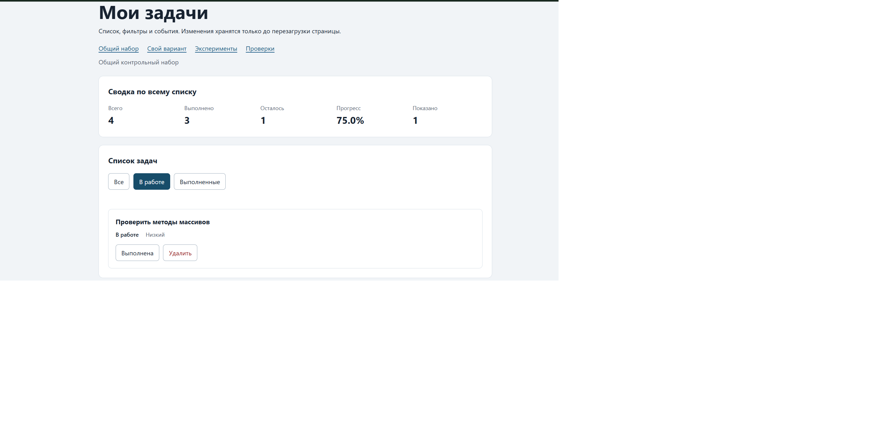

# Практическая работа № 3. Работа с DOM и событиями

## Данные работы

| Поле | Значение |
|---|---|
| Имя | Тимофей |
| Группа | ЭФБО-05-25 |
| Вариант из ПР2 | 3 (журнал № 19) |
| Node.js | v24.15.0 |
| Браузер | Google Chrome 154.0.8037.59 (64 бит) |
| Операционная система | Windows 10 (10.0.19045.6456) |

> Часть значений ниже (протоколы, эксперименты, сценарии) получена прогоном в учебной среде
> (Node 22, headless Chromium). Перед сдачей их нужно повторить на своём компьютере
> и при расхождении заменить фактическими.

## Запуск

Рабочая папка: `practice-03` внутри личного репозитория.

```bash
npm run check:service
npm start
```

Устанавливать зависимости через `npm install` не требуется.

```text
http://127.0.0.1:5503/
http://127.0.0.1:5503/index.html?dataset=variant
http://127.0.0.1:5503/examples/dom-events.html
http://127.0.0.1:5503/checks.html
```

Остановка сервера: `Ctrl+C`.

## Что перенесено из ПР2

Файлы `src/task-service.js` (9 функций: создание, поиск, выборки, сводка, добавление,
изменение статуса, переименование, удаление) и `src/data.js` (общий набор `demoTasks`,
номер варианта 3 и шесть задач варианта) перенесены из собственного решения ПР2 без изменений.
Повторная проверка `npm run check:service` — 35 пройдено, 0 ошибок (протокол ниже).
Исправлять сервис не потребовалось: интерфейс вызывает его функции и читает `result.ok`.

## Эксперименты

Колонка «Прогноз» заполнена по знанию DOM; результаты получены запуском `examples/dom-events.html`.

| № | Прогноз | Результат | Объяснение |
|---:|---|---|---|
| 1. Отсутствующий элемент и коллекция | `querySelector` вернёт `null`, `querySelectorAll` — пустую коллекцию | `null`; длина коллекции 0 | `querySelector` при отсутствии совпадений возвращает `null`, поэтому перед использованием нужна проверка. `querySelectorAll` всегда возвращает коллекцию, возможно пустую. |
| 2. dataset и числовой id | `dataset.taskId` будет строкой `"23"` | `"23"` (строка); `Number("23")` → 23 | Значения `data-*` всегда строки. Для id применяется `Number`, а не `parseInt`: `Number("4abc")` даёт `NaN`, `parseInt("4abc")` дал бы 4. |
| 3. Статический NodeList | Старый список не изменится, новый запрос увидит новые элементы | Старый NodeList: длина 1. После двух нажатий «Добавить запись» новый `querySelectorAll` даёт 2, затем 3; в списке 3 `li` | `querySelectorAll` возвращает снимок. После изменения DOM нужно делать запрос заново. |
| 4. Строка с HTML-разметкой | При записи через `textContent` разметка останется текстом | В заголовке буквальная строка `<strong>Это текст, а не HTML</strong>`, дочерних элементов 0 | `textContent` вставляет строку как текст, теги не разбираются. Поэтому `innerHTML` в проекте не используется. |
| 5. Распространение события | Клик по вложенному span: capture на карточке, затем bubbling на кнопке и карточке | `1. phase=1; target=lab-label; currentTarget=lab-card`; `2. phase=3; target=lab-label; currentTarget=lab-button`; `3. phase=3; target=lab-label; currentTarget=lab-card` | `target` — элемент, по которому кликнули (span), `currentTarget` — тот, чей обработчик сейчас выполняется. Фаза 1 — погружение, 3 — всплытие. Клик по самой кнопке даёт фазы 1, 2, 3 при `target = lab-button`. |

## Организация кода

- `src/task-service.js` — данные: чистые функции без DOM; результат `{ ok, tasks }` или `{ ok: false, error }`. Входной массив не меняется.
- `src/task-selectors.js` — `getVisibleTasks(tasks, filter)`: вычисляет, что показать (`all` / `pending` / `completed`), возвращает новый массив и ничего не меняет.
- `src/task-view.js` — только отрисовка: `createTaskElement`, `renderTaskList` (через `replaceChildren`), `renderSummary`, `renderEmptyState`. Всё выводится через `textContent`, `innerHTML` не используется. Обработчиков здесь нет.
- `src/main.js` — состояние и события. Полный список хранится в `currentTasks`, фильтр — в `currentFilter`. Событие списка обрабатывается в `handleTaskListClick` (делегирование на `ul#task-list`), событие фильтров — в `handleFilterClick`. `renderApp()` строит видимую выборку, перерисовывает список, сводку и пустое состояние.
- Сводка вычисляется функцией `getTaskStats` по **полному** массиву, число «Показано» передаётся отдельно, поэтому фильтр не искажает общие показатели.

Поток данных: клик → `closest` → `Number(dataset.taskId)` → сервис → при `ok` новое `currentTasks` → `renderApp()` → восстановление фокуса.

## Общий сценарий

| Шаг | Видимые id | Всего | Выполнено | Осталось | Прогресс | Показано | Сообщение | Совпало с ожиданием |
|---:|---|---|---|---|---|---|---|---|
| 0. Начало, фильтр «Все» | 1, 4, 7, 10 | 4 | 2 | 2 | 50.0% | 4 | — | да |
| 1. Фильтр «В работе» | 4, 7 | 4 | 2 | 2 | 50.0% | 2 | — | да |
| 2. Переключить id 4 | 7 | 4 | 3 | 1 | 75.0% | 1 | — | да |
| 3. Фильтр «Все» | 1, 4, 7, 10 | 4 | 3 | 1 | 75.0% | 4 | — | да |
| 4. Удалить id 7 | 1, 4, 10 | 3 | 3 | 0 | 100.0% | 3 | — | да |
| 5. Фильтр «В работе» | — | 3 | 3 | 0 | 100.0% | 0 | Нет задач по выбранному фильтру. | да |
| 6. Фильтр «Все», переключить id 1 | 1, 4, 10 | 3 | 2 | 1 | 66.7% | 3 | — | да |
| 7. Удалить 1, 4, 10 | — | 0 | 0 | 0 | 0.0% | 0 | Список задач пуст. | да |

После перезагрузки страницы приложение вернулось к состоянию шага 0: данные хранятся только в памяти.

## Индивидуальный вариант

Тема: портфолио (вариант 3). Страница `?dataset=variant`, подпись «Индивидуальный вариант: 3».
Исходные задачи: 11 «Выбрать структуру разделов портфолио» (выполнена, средний), 23 «Подготовить описания проектов» (выполнена, высокий), 37 «Сверстать главную страницу» (высокий), 41 «Добавить адаптивность для телефона» (средний), 58 «Собрать форму обратной связи» (низкий), 64 «Опубликовать сайт на хостинге» (низкий).

| Этап | Всего | Выполнено | Осталось | Прогресс | Видимые id |
|---|---|---|---|---|---|
| До действий | 6 | 2 | 4 | 33.3% | 11, 23, 37, 41, 58, 64 |
| После переключения 23 | 6 | 1 | 5 | 16.7% | 11, 23, 37, 41, 58, 64 |
| После удаления 37 | 5 | 1 | 4 | 20.0% | 11, 23, 41, 58, 64 |
| Итог, фильтр «В работе» | 5 | 1 | 4 | 20.0% | 23, 41, 58, 64 |
| Итог, фильтр «Выполненные» | 5 | 1 | 4 | 20.0% | 11 |

Названия и приоритеты сохраняются после операций.

## Протокол проверки сервиса

```text
OK: 01. Создание задачи с явным приоритетом
OK: 02. Приоритет по умолчанию
OK: 03. Удаление краевых пробелов без изменения внутренних
OK: 04. Граничные длины названия и положительный безопасный id
OK: 05. Некорректные названия при создании
OK: 06. Некорректные идентификаторы при создании
OK: 07. Все допустимые приоритеты и отклонение недопустимых
OK: 08. Каждый вызов createTask возвращает новый объект
OK: 09. Поиск по id, а не по индексу
OK: 10. Отсутствующая задача и пустой массив при поиске
OK: 11. Поиск не преобразует строковый id в число
OK: 12. Получение невыполненных задач
OK: 13. Пустой список, все выполнены и все не выполнены
OK: 14. Названия в исходном порядке и пустой список
OK: 15. Сводка по общему набору
OK: 16. Сводка по пустому списку
OK: 17. Сводка: ничего не выполнено и выполнено всё
OK: 18. Процент остаётся числом без предварительного округления
OK: 19. Добавление в конец без изменения входного массива
OK: 20. Добавление в пустой список с приоритетом по умолчанию
OK: 21. Повторяющийся id отклоняется
OK: 22. Добавление не обходит проверки createTask
OK: 23. Изменение completed в обе стороны
OK: 24. completed принимает только boolean
OK: 25. Некорректный или отсутствующий id при изменении статуса
OK: 26. Повторная установка статуса создаёт новый результат
OK: 27. Переименование сохраняет остальные поля
OK: 28. Проверки названия при переименовании
OK: 29. Некорректный или отсутствующий id при переименовании
OK: 30. Удаление по id с сохранением порядка
OK: 31. Удаление единственной записи
OK: 32. Некорректный, отсутствующий id и удаление из пустого списка
OK: 33. Входные объекты не изменяются ни одной операцией
OK: 34. Общий сценарий и все промежуточные сводки
OK: 35. Работа с другим набором, без зависимости от demoTasks

Проверок пройдено: 35; не пройдено: 0.
```

## Протокол браузерных проверок

```text
Текстовый протокол
OK: Фильтр all возвращает новый массив в исходном порядке
OK: Фильтр pending выбирает невыполненные задачи
OK: Фильтр completed выбирает выполненные задачи
OK: Все три фильтра работают с пустым списком
OK: Фильтрация не меняет входные записи и их порядок
OK: Карточка — li.task-card с числовым id в dataset
OK: Статус невыполненной карточки и aria-pressed согласованы
OK: Статус выполненной карточки и aria-pressed согласованы
OK: В карточке две обычные кнопки с вложенными подписями
OK: Все приоритеты отображаются по установленному словарю
OK: Название с разметкой отображается текстом
OK: Отрисовка списка создаёт карточки в исходном порядке
OK: Повторная отрисовка не накапливает карточки
OK: Контейнер списка и его обработчик сохраняются
OK: Отрисовка пустого массива очищает прежние карточки
OK: Сводка считается по всему списку, отдельно выводится Показано
OK: Пустая сводка не содержит NaN и Infinity
OK: Сообщение для полностью пустого списка
OK: Сообщение для пустого результата фильтра
OK: Появление карточек скрывает прежнее пустое состояние
OK: Приложение: начальный набор и сводка
OK: Приложение: фильтр срабатывает по клику на вложенный span
OK: Приложение: активный фильтр отмечен классом и aria-pressed
OK: Приложение: фильтрация не удаляет скрытые задачи
OK: Приложение: переключение по id, а не индексу массива
OK: Приложение: выполненная задача исчезает из фильтра В работе
OK: Приложение: удаление изменяет данные, а не только DOM
OK: Приложение: клик по названию не изменяет данные
OK: Приложение: после перерисовок одно нажатие — одно изменение
OK: Приложение: удаление всех записей и нулевая сводка
OK: Приложение: нет совпадений — не то же самое, что нет задач
OK: Приложение: неизвестный числовой id не меняет данные
OK: Приложение: id 4abc не превращается в 4
OK: Приложение: неизвестное действие игнорируется
OK: Приложение: после изменения сохраняется клавиатурный фокус
OK: Приложение: новая загрузка возвращает исходное состояние

Всего: 36. Пройдено: 36. Ошибок: 0.
```

## Собственные проверки

| № | Исходное состояние и действия | Ожидаемый результат | Фактический результат | Итог |
|---:|---|---|---|---|
| 1 (граница) | Общий набор; удалить 1, 4, 7 (остаётся id 10); фильтр «В работе»; фильтр «Выполненные»; удалить последнюю | После удаления: 1/1/0/100.0%. «В работе» — пусто и «Нет задач по выбранному фильтру.». «Выполненные» — [10]. После последнего удаления — 0/0/0/0.0% и «Список задач пуст.» | Совпало; фокус после удаления последней карточки перешёл на активный фильтр | пройдена |
| 2 (повторная отрисовка) | Пять быстрых переключений id 4 подряд | Одно нажатие — одно изменение: после нечётного числа кликов id 4 выполнена; 4/3/1/75.0%; карточек по-прежнему 4 | id 4 выполнена, 4/3/1/75.0%, карточек 4, `aria-pressed="true"` | пройдена |
| 3 (фильтр и данные) | Фильтр «Выполненные»; переключить id 1; затем подменить `data-task-id` на 777 и удалить; затем фильтр «Все» | Видимые [10], статистика 4/1/3/25.0%; для 777 сообщение «Задача с id 777 не найдена», данные не меняются; «Все» очищает сообщение и показывает все 4 | Совпало: [10], 4/1/3/25.0%; сообщение «Задача с id 777 не найдена»; после «Все» сообщение пусто, [1,4,7,10], 4/1/3/25.0% | пройдена |
| 4 (неизменность исходных данных) | После операций прочитать экспортированный `demoTasks` | Исходный набор не изменён | 1: true, 4: false, 7: false, 10: true | пройдена |
| 5 (длинный текст и разметка) | Название длиной 100 символов; название `<b>x</b> & "q"` | Выводится полностью/текстом, дочерних элементов нет | Длина 100 выведена целиком; разметка показана как текст, 0 дочерних элементов | пройдена |

## Отладка и клавиатура

Точка останова: `src/main.js`, строка 68 (`const id = Number(card.dataset.taskId);`), клик по кнопке «Выполнена» у задачи id 4.

| Значение | Результат |
|---|---|
| `event.target` | `span.action-label` (клик попал во вложенную подпись) |
| `event.currentTarget` | `ul#task-list` (обработчик висит на списке) |
| `card.dataset.taskId` | `"4"` (строка) |
| числовой `id` | `4` (число) |
| действие | `"toggle"` |
| найденная задача | `{ id: 4, title: "Подготовить модель задач", completed: false, priority: "high" }` |
| результат сервиса | `{ ok: true, tasks: [...] }`, у id 4 `completed: true` |

Клавиатура: порядок Tab — четыре ссылки в шапке, три кнопки фильтра, затем у каждой карточки «Выполнена» и «Удалить». Enter и Space на кнопке статуса меняют статус ровно один раз, фокус остаётся на кнопке той же карточки. После Enter на «Удалить» фокус переходит к следующему допустимому элементу — активной кнопке фильтра «Все» (если карточки с действием больше нет).

Отказы: при подмене `data-task-id` на `777` и удалении — сообщение «Задача с id 777 не найдена», данные не меняются. При значении `4abc` — сообщение «Некорректный идентификатор задачи», данные не меняются (через `Number` значение не превращается в 4). Выбор фильтра перерисовывает интерфейс из настоящего массива и очищает сообщение.

## Вид приложения

   

## Дополнительное задание

Дополнительное задание не выполнялось.

## Вывод

Реализован интерфейс списка задач на DOM API: карточки создаются через `createElement` и `textContent`, фильтры и действия работают через делегирование событий на двух контейнерах, `closest` позволяет обрабатывать клики по вложенным элементам, id из `dataset` преобразуется через `Number` с проверкой. Все проверки сервиса (35) и браузерные проверки (36) пройдены.

Главное различие: изменение данных — это новый массив `currentTasks` после операции сервиса, а изменение DOM — лишь отображение этих данных. Удалить карточку из DOM без изменения массива нельзя считать удалением задачи: при следующей отрисовке она вернётся. Фильтр не изменяет данные, а только выбирает, что показывать.
